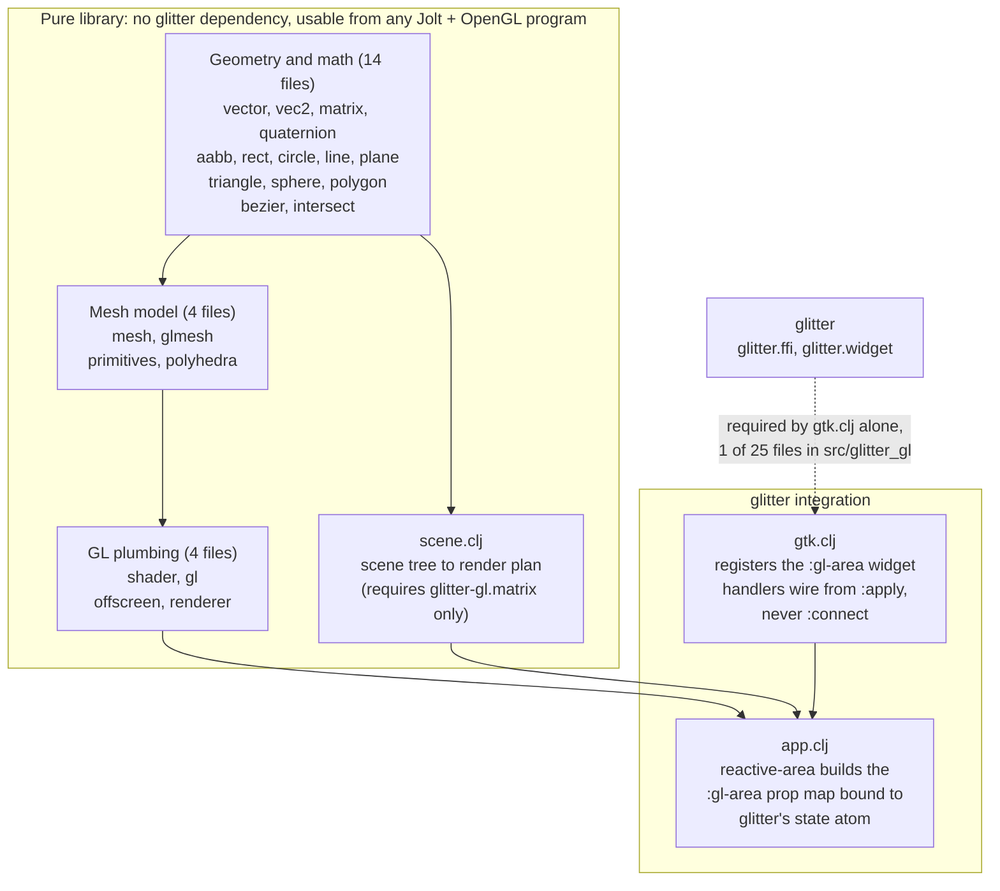

# Contributing

Thanks for taking an interest. glitter-gl is an OpenGL geometry, matrix,
and shader library for [glitter](https://github.com/burinc/glitter) (a
Replicant-style GTK4 renderer for
[Jolt](https://github.com/jolt-lang/jolt): native Clojure on a Chez
Scheme host, no JVM), ported from
[glimmer-gl](https://github.com/jolt-lang/glimmer-gl), the same library
for glimmer, glitter's Reagent-style sibling.

The deep documentation lives in [`docs/guide/`](docs/guide/index.md).

## Setting up

You need [Jolt](https://github.com/jolt-lang/jolt), GTK4 + GLib, and a
native OpenGL:

```sh
jolt --version         # Jolt itself
brew install gtk4      # macOS; on Linux use your distro's gtk4 + glib dev packages
```

`deps.edn`'s `:jolt/native` declares the native libraries: the macOS
`OpenGL.framework` path and Linux's `libGL.so` for GL itself, plus
`glib-2.0`/`gobject-2.0`/`gio-2.0`/`gtk-4` pulled in transitively via
`../glitter`'s own `deps.edn`.

**`glitter-gl` depends on `../glitter` through a `:local/root` entry, not
a versioned dependency.** Clone both repos as sibling checkouts under the
same parent directory:

```
some-parent-dir/
├── glitter/
└── glitter-gl/
```

[babashka](https://babashka.org) is optional but makes everything
friendlier: `bb info` prints a grouped cheat-sheet of every task. Without
it, use `jolt -M:<alias>` directly; see the aliases in `deps.edn`.

`clj-kondo` and `clojure-lsp` on your `PATH` are optional, but every `bb
lint*`/`bb lsp:*`/`bb verify`/`bb hooks:install*` task needs them to run
at all. Without them you lose the fast local lint/format/clean-ns loop
(including the git pre-commit hook described below), but the unit suite
and every demo/smoke still work fine.

## Before you open a PR

```sh
bb test              # unit suite (headless, no display needed)
bb lint              # clj-kondo over glitter-gl-authored code (report only)
bb lsp:format-check  # clojure-lsp formatting, dry run
bb smokes            # every live-GTK smoke/check in sequence (needs a display)
```

`bb smokes` drives real GTK4 rather than reasoning about a widget's
lifecycle in the abstract. GTK4 is a live, stateful system with a
blocking main loop, and this project's one real bug (see Invariant #2)
was "obviously correct" on paper and wrong only when actually run.

**CI runs `bb test`, the lint and the format check on every PR**, plus
`bb lsp:clean-ns-check` and a check that no Markdown file has gained an
em-dash. See `.github/workflows/ci.yml`. One difference worth knowing:
CI lints with `bb lint:strict`, which fails on warnings as well as
errors, so a finding your local `bb lint` merely reports will still stop
the build.

A second CI job runs the same suite plus `bb smokes` under Xvfb, with
mesa's llvmpipe as a software rasterizer, so a runner with no GPU still
gets a real GL context. It reports GL 4.5, well past the 3.3 that
`glitter-gl.offscreen-test` asserts, so the render-to-texture round trip
and the live `[:gl-area]` mount both genuinely execute there.

That job is informational for now, meaning it reports but cannot fail
the build. Treat it as a signal rather than a gate, and keep running
`bb smokes` yourself if you touched `gtk.clj`, `scene.clj` or `app.clj`.
Software rendering is not the same as your driver, and a 500ms
auto-quit that is comfortable on a warm runner is not proof it will be
comfortable on a busy one.

One thing worth knowing if you ever read that job's output:
`glitter-gl.offscreen-test` **passes when it skips**. Printing `SKIP
offscreen GL: ...` and moving on is deliberate, because a machine with
no display is a legitimate environment rather than a failure. It also
means a green suite is not evidence that GL ran, so the Xvfb job greps
its own output for that banner and fails on it. If you change what that
test prints, change the grep in `.github/workflows/ci.yml` with it.

`bb verify` bundles a lint report plus `jolt -M:test` (which must pass)
into one pre-commit-shaped command, but **it does not check formatting**.
The installed git hook (`bb hooks:install`) is a separate, stricter gate
that runs on every `git commit`: lint errors-only, `clojure-lsp format
--dry`, and `clojure-lsp clean-ns --dry` (`bb hooks:install:full` adds the
unit suite on top). A clean `bb verify` is **not** a guarantee the hook
will also pass: format drift is only caught by the hook.

### Prose style in docs

Two conventions the tooling cannot enforce, so they are written down here
instead of living in a commit message where the next contributor will not
find them.

**No em-dashes.** The Markdown in this repo uses commas, colons,
semicolons, parentheses or a sentence break instead, chosen to fit the
sentence rather than swapped in mechanically. To check a change:

```sh
# \u2014 rather than a literal, so this command does not match itself
git ls-files '*.md' | xargs grep -n $'\u2014' || echo "clean"
```

`docs/demos/README.md` is generated by `bb record` from
`scripts/demo_manifest.edn`, so fix the manifest's `:preamble` and
descriptions rather than the generated file.

**Do not cite `AGENTS.md`.** It is not part of this repository. Point
readers at this file's invariants, or at the relevant page under
`docs/guide/`.

## Architecture



Two independent halves. The geometry/matrix/mesh/shader/GL layer has no
dependency on glitter at all; it's usable from any Jolt program with an
OpenGL context, glitter or not. `glitter-gl.gtk`/`.scene`/`.app` are the
glitter-specific layer: a `:gl-area` widget and a declarative scene-graph
that plug into glitter's own hiccup/state-atom model.

Full breakdown: [`docs/guide/architecture.md`](docs/guide/architecture.md).

## Invariants: please don't regress these

Each of these was real: most were found live, several the hard way.
This numbering is stable: entries are never reordered or renumbered, so
a citation like "invariant #2" elsewhere in this repo always means this
entry.

1. **Verbatim-port files are namespace-rename-only.** The 22 files making
   up the geometry/matrix/mesh/shader/GL layer (`vector.clj` through
   `renderer.clj`) are ported from glimmer-gl by mechanical namespace
   substitution and nothing else. A real behavioral change to one of them
   belongs in its own reviewed commit, never folded silently into a "port"
   commit. **Project-wide formatting passes are exempt**: `clojure-lsp
   format`/`clean-ns` change whitespace and `:require` ordering only,
   never logic, so running them across these files too (as this project
   has, to keep the git hook's `format --dry` gate meaningful) does not
   violate the rule. See
   [`porting-and-attribution.md`](docs/guide/porting-and-attribution.md).

2. **`:gl-area`'s lifecycle handlers wire from the widget spec's `:apply`
   closure, not from glitter.widget's `:connect` hook.** This is a
   correction, not the original design, and it's easy to get wrong again,
   because glitter's own `register-widget!` docstring names a `GtkGLArea`'s
   realize/render/resize as `:connect`'s motivating example. In practice,
   glitter's reconciler never hands an element's real hiccup props to
   `:connect`; they arrive through a separate path that calls the spec's
   `:apply` closure once per prop key, at construction and on every
   re-render. A `:connect`-wired handler silently never fires. Full
   mechanics: [`gl-area-widget-layer.md`](docs/guide/gl-area-widget-layer.md).

3. **`glitter-gl.scene`'s `plan` and `glitter-gl.app`'s `reactive-area`
   take glitter's state atom directly; there is no reactive-cell
   tracking.** glimmer-gl's originals wrap the compiled scene plan in a
   dependency-tracked reaction. glitter has no equivalent: its state-atom
   watcher already recomputes the whole view on every change, so the scene
   plan is just a plain function of `state`, called fresh on every render.
   This is a deliberate simplification, not a missing feature. See
   [`scene-and-app.md`](docs/guide/scene-and-app.md).

4. **`reactive-area`'s own `:gl-area` handlers read and write glitter's
   state atom directly; they do not go through action-dispatch.**
   Ordinary UI chrome (buttons, sliders) dispatches `[[:action/foo arg]]`
   tuples through one global function. GL-plumbing state that can change
   60 times a second has no business round-tripping through that path, so
   `reactive-area`'s tick/motion/key/button closures `swap!`/`reset!` the
   shared state atom directly instead. See
   [`scene-and-app.md`](docs/guide/scene-and-app.md).

5. **There's no function-as-hiccup-tag convention, same as glitter
   itself.** A helper that builds a UI hiccup fragment must be called as a
   plain function spliced into the parent vector, `(my-fn args…)`, never
   embedded as `[my-fn args…]`. A vector whose head is a function value
   fails glitter's hiccup check and renders as stringified literal text
   instead of throwing, so the mistake is silent. **The one exception:**
   `glitter-gl.scene`'s own scene-tree hiccup (`[:group ...]`, `[my-component
   args...]`) is a separate mini-hiccup dialect, consumed only by
   `glitter-gl.renderer`, and it deliberately *does* support `[fn
   args...]` component expansion. Don't confuse the two.

6. **`:scale` is deliberately not registered by this library.**
   glimmer-gl ships its own `:scale` widget; glitter already has a richer,
   first-party native `:scale`. Porting glimmer-gl's would silently
   conflict with it. If you're looking for `:scale`, it's registered by
   glitter itself, not by glitter-gl.

7. **Stage files by explicit path when committing; never `git add -A`/
   `.`/`-u`.** A broad add sweeps up unrelated untracked files (stale
   notes, editor backups) into a feature commit.

8. **`bb.edn`/`deps.edn` `:tasks` bodies are EDN-parsed.** No `#"regex"`,
   `@deref`, or `#(...)` reader macros: use `(re-pattern …)`, `(deref …)`,
   `(fn [x] …)`. A mistake here aborts *every* `bb` invocation, not just
   the edited task.

9. **`:gl-area`'s lifecycle handlers wire once, on the first `:apply` call
   per event per widget; a later render supplying different closures for
   the same element has no effect.** Unlike most other widgets (whose
   props re-apply on every render), `:gl-area` guards each event so only
   the first closure it sees ever connects; every later `:apply` call for
   that event is a silent no-op. Build a `:gl-area` prop map (e.g. via
   `glitter-gl.app/reactive-area`) exactly once, at a stable call site, and
   reuse the same result across renders. Full contract:
   [`gl-area-widget-layer.md`](docs/guide/gl-area-widget-layer.md).

10. **`:gl-area`'s `:on-*` props trip glitter's dev-time hiccup warning on
    every render, and it cannot be silenced from application code.**
    glitter flags any prop key starting with `"on"` as a probable mistake,
    with no way to exempt one widget's non-event `on-*` props from that
    check. The warning is cosmetic (the value is still applied correctly),
    but `glitter.env/configure!`, which looks like the escape hatch,
    only works if called before `glitter.core` is `require`d anywhere in
    the process, which no single application namespace's own `-main` can
    arrange on its own. Full explanation:
    [`gl-area-widget-layer.md`](docs/guide/gl-area-widget-layer.md).

## Adding a widget

`:gl-area` is the only widget this project ships. `glitter.widget/specs`
maps a hiccup tag to a constructor, a prop-applier, and a container
strategy; `register-widget!` adds one from outside the library, the same
mechanism `glitter-gl.gtk` itself uses.

Before writing a new one, read
[`gl-area-widget-layer.md`](docs/guide/gl-area-widget-layer.md). The
`:apply`-vs-`:connect` correction (Invariant #2) is the single most
important thing to know, because it looks wrong: `:connect` reads as the
natural place to wire a widget's signal handlers, and glitter's own
docstring says so. It doesn't work, and the failure is silent. Once
handlers are wired through `:apply` instead, remember Invariant #9: guard
each event so only the first closure that arrives ever connects, the way
`gtk.clj`'s `wired` atom does; otherwise a later render's closures are
silently dropped rather than replacing the earlier ones.

## Known limitations

See [`docs/guide/limitations.md`](docs/guide/limitations.md) for the full
list, rather than a duplicate one here.

## Licensing

glitter-gl is released under the Apache License, Version 2.0; see
[`LICENSE`](LICENSE). By contributing, you agree your contribution is
licensed under those terms.

The project vendors ported code (from thi.ng/geom, via glimmer-gl) under
file-by-file attribution in [`NOTICE.md`](NOTICE.md). If your change moves
code between the verbatim/adapted/new buckets, or introduces a new
upstream source, please update `NOTICE.md` and
[`porting-and-attribution.md`](docs/guide/porting-and-attribution.md) in
the same PR.
