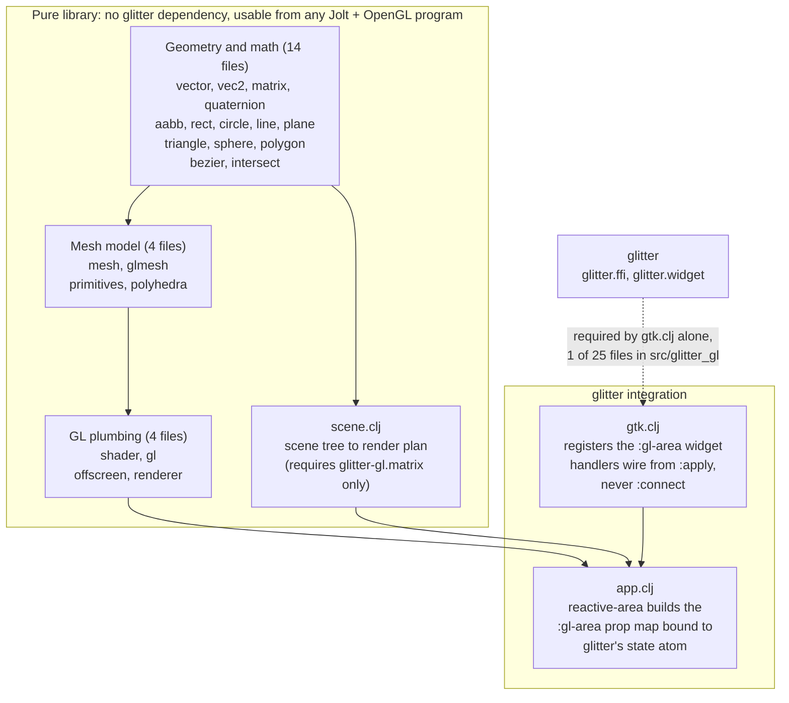

# glitter-gl

An OpenGL geometry, matrix, and shader library for
[glitter](https://github.com/burinc/glitter), a Replicant-style GTK4
renderer for [Jolt](https://github.com/jolt-lang/jolt). Ported from
[glimmer-gl](https://github.com/jolt-lang/glimmer-gl), which does the same
for [glimmer](https://github.com/jolt-lang/glimmer) (glitter's
Reagent-style sibling). It does two things:

- **Composable geometry**, ported (via glimmer-gl) from
  [thi.ng/geom](https://thi.ng/geom): build 3D solids as plain Clojure
  data, transform and combine them, and tessellate to a GL-ready vertex
  buffer. Vectors, column-major 4×4 matrices, a mesh model, and primitive
  constructors.
- **Shaders as data** (`glitter-gl.shader`), ported (via glimmer-gl) from
  thi.ng/geom's shader-spec model: declare a shader's interface (uniforms,
  attributes, varyings, version) as maps and compose its stages from
  reusable GLSL snippets; the declarations are generated and only emitted
  as a GLSL string when you compile.
- **A GL widget for glitter**: requiring `glitter-gl.gtk` registers a
  `:gl-area` (a GtkGLArea drawing surface) into glitter's widget registry,
  so a GL pane lives in the same reconciled hiccup tree as the rest of
  your UI.

`glitter-gl.vector` gives unboxed 3D vectors, `glitter-gl.matrix` gives
column-major 4×4 matrices (the layout `glUniformMatrix4fv` expects) with
inlined flonum arithmetic, `glitter-gl.gl` binds the slice of OpenGL you
need to compile shaders and fill buffers/VAOs/uniforms, and
`glitter-gl.mesh` / `glitter-gl.primitives` are the thi.ng/geom-style
composition layer.

**Docs site:** [glitter-gl.b12n.app](https://glitter-gl.b12n.app)

> The site is built but not yet published as of this arc: no DNS, no
> bucket, no GitHub Pages. The URL will not resolve until the go-public
> sequence runs; until then, browse the same content directly in
> [`docs/guide/`](docs/guide/index.md).

## Quick start

```sh
jolt -M:plasma         # rotating cube/sphere/tetra + composable plasma/stripes shader
jolt -M:check          # headless sanity check: shader compiles, geometry buffers valid
jolt -M:test           # unit suite
jolt -M:gl-area-smoke  # live-GTK smoke: :gl-area construct/realize/render/resize
```

**In CI, invoke the alias form** (`jolt -M:test`, not `jolt test`). Same
exit-code caveat as glitter itself (see glitter's own README).

### Or via `bb`

```
bb info      # start here: grouped task list
bb test      # jolt -M:test
bb plasma    # interactive demo
bb check     # headless sanity check
bb smokes    # live-GTK smoke, CI-safe
bb hooks:install / :install:full / :uninstall  # git pre-commit hook: fast | +tests | remove
```

`bb hooks:install` sets up a fast pre-commit hook (lint errors + format +
ns cleanliness) that gates every commit on staying `bb lsp:format-check`-
clean: the whole codebase is formatted uniformly, including the 22 files
ported verbatim from glimmer-gl. See [`CONTRIBUTING.md`](CONTRIBUTING.md)'s
invariant #1 for why a project-wide `clojure-lsp format` pass doesn't conflict
with the "don't improve ported files" porting discipline. It mirrors
glitter's identical resolution of the same tension for its own
Replicant-ported files.

## Architecture



- `glitter-gl.gtk` registers `:gl-area` into glitter's widget registry.
  The imperative realize/render/resize/tick/motion/key/button signals are
  wired from the widget spec's `:apply` closure (called once per prop key
  at construction, and again on every re-render), guarded so each event
  only ever connects once per widget. This is a real, live-found
  correction to the original design, which called for wiring them once at
  construction via glitter.widget's `:connect` hook. `:connect` never
  actually sees a hiccup element's real props under glitter's reconcile
  flow, so it silently never fired. See
  [`docs/guide/gl-area-widget-layer.md`](docs/guide/gl-area-widget-layer.md)
  for the full story.
- `glitter-gl.scene`/`glitter-gl.app` do NOT track reactive-cell
  dependencies the way glimmer-gl's originals do: glitter's own
  state-atom watcher already recomputes the whole view on every change, so
  a GL scene built the same way (a pure function of `state`) needs no
  separate tracking layer.

## Documentation

The full guide is nine pages under [`docs/guide/`](docs/guide/index.md),
one topic per page:

- [`architecture.md`](docs/guide/architecture.md): the four-layer
  stack, how thin the seam to glitter actually is (one file has a
  literal `:require` on `glitter.*`), and why a `:gl-area` keeps
  redrawing even though a bare state change doesn't cause it to.
- [`geometry-and-shaders.md`](docs/guide/geometry-and-shaders.md):
  orientation over the 22 verbatim-ported namespaces. The three
  groups, where a mesh becomes GL data, and why the matrices are
  column-major.
- [`gl-area-widget-layer.md`](docs/guide/gl-area-widget-layer.md):
  the `:gl-area` widget's mechanics in full. The `:apply`-vs-`:connect`
  correction, traced through the actual reconciler code path, plus
  every non-standard GTK4 signal shape it has to handle.
- [`scene-and-app.md`](docs/guide/scene-and-app.md): the declarative
  scene graph's mini-hiccup dialect (and why it's not glitter's own
  hiccup), why `plan` has no reactive-cell tracking, and the write-once
  handler contract.
- [`porting-and-attribution.md`](docs/guide/porting-and-attribution.md):
  the three sourcing buckets, the Standard Verbatim Port Procedure,
  and the lineage back through glimmer-gl to thi.ng/geom.
- [`examples.md`](docs/guide/examples.md): what each of the seven
  `examples/glitter_gl/` namespaces is for, and which two are actually
  wired into regression coverage. Includes a four-take gallery of the
  `plasma` demo, plus one take each of `ripple`, `orbit` and `knot`.
- [`testing-and-tasks.md`](docs/guide/testing-and-tasks.md): the unit
  suite, the live-GTK smoke and headless check `bb smokes` runs, and the
  quality-tooling task surface (lint, format, `clj-kondo`'s FFI hook, the
  git pre-commit gate).
- [`limitations.md`](docs/guide/limitations.md): every known v1 gap,
  each with the reason it was left rather than fixed.
- [`index.md`](docs/guide/index.md): the guide's own nav map, if
  you'd rather start there.

Plus:

- **[`CONTRIBUTING.md`](CONTRIBUTING.md)**: how to build, test, and submit
  changes, and the ten invariants this project does not regress.
- **[`NOTICE.md`](NOTICE.md)**: file-by-file attribution for the ported code.
- Design spec and implementation plan are not part of this repo; they live in
  a private planning store.

## Contributing

See [`CONTRIBUTING.md`](CONTRIBUTING.md) for setup, the ten numbered
invariants this project does not regress, and how to add a widget.
Before opening a PR, run the four local gates: `bb test`, `bb lint`,
`bb lsp:format-check`, and `bb smokes`. **CI is not wired up yet**:
these four commands are the whole gate for now, so please run them
yourself.

## Status

Ported from glimmer-gl (2026-08-06 arc). See `NOTICE.md`'s porting ledger
for the full verbatim/adapted/new breakdown, including a real live-found
correction to `:gl-area`'s original wiring design (see
[`docs/guide/gl-area-widget-layer.md`](docs/guide/gl-area-widget-layer.md)).
The unit suite currently stands at 177 tests / 556 assertions (`bb test`),
plus `bb smokes`' live-GTK smoke (`gl-area-smoke`, which drives a real
`GtkGLArea` under the real reconciler rather than a fake renderer) and its
headless check (`check`, which needs no GL context or display at all).
`glitter-gl.app`'s scene-graph/shadow-mapping renderer path
(`reactive-area`) is ported, unit-tested, and, as of this arc, exercised
live end to end by `examples/glitter_gl/orbit.clj`. The `plasma` demo
still wires `:gl-area` directly, the same way glimmer-gl's own upstream
demo does; `ripple` and `knot` do too, for reasons of their own (see
`NOTICE.md`). See
[`docs/guide/limitations.md`](docs/guide/limitations.md) for this and
every other known v1 gap.
