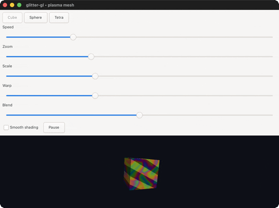
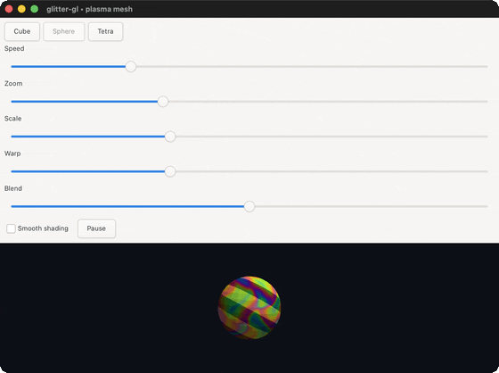
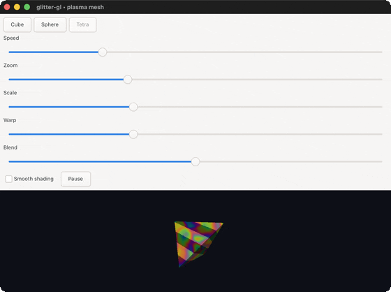
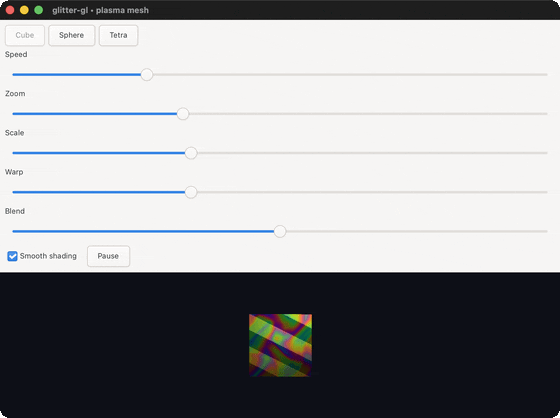

# Demos

Animated previews of glitter-gl's example gallery: the plasma demo (four takes) plus ripple, orbit, knot, gears, textured and picking. Regenerate with `bb record` (maintainer-only: it needs an internal capture tool that is not publicly released). The GIFs here are committed, so you do not need it to browse them.

## the plasma demo

### plasma-cube

the default cube, rotating under the composable plasma/stripes shader

### plasma-sphere

the same shader on a sphere

### plasma-tetra

the same shader on a tetrahedron

### plasma-smooth

smooth shading, against the flat shading of the takes above

## the ripple demo

### ripple

a full-screen fragment shader, no mesh, no lighting, no camera

## the orbit demo

### orbit

six distinct solids orbiting above a ground plane, lit and shadowed, mounted via reactive-area

## the knot demo

### knot

a (2,3) trefoil torus knot generated from scratch, 2400 quads

## the gears demo

### gears

three counter-rotating cog outlines, flat-shaded in 2D, no lighting or camera

## the textured demo

### textured

a rotating cube wearing a procedural checkerboard texture, generated at runtime, no image file

