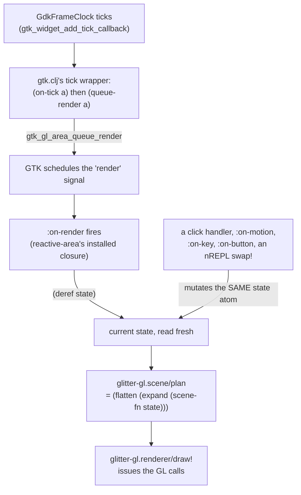

# Architecture

## The split: two libraries in one repo, and how thin the seam is

`glitter-gl` reads as one project but is really two: a geometry/matrix/
mesh/shader/GL library that knows nothing about any UI toolkit, and a
thin glitter-integration layer bolted on top of it. The
[README](../../README.md) and [`CONTRIBUTING.md`](../../CONTRIBUTING.md)
both describe this as "`glitter-gl.gtk`/`.scene`/`.app` are the
glitter-specific layer" — true as a grouping, but the actual
`:require` graph is sharper than that phrasing suggests, worth stating
precisely because it's the whole reason the split is load-bearing rather
than cosmetic:

- Of the 25 files under `src/glitter_gl/`, exactly **one** —
  `glitter_gl/gtk.clj` — has a literal `:require` on a `glitter.*`
  namespace (`glitter.ffi`, `glitter.widget`).
- `app.clj` never requires `glitter.*` directly. It only reaches glitter
  transitively, through requiring `glitter-gl.gtk` (for
  `gtk/widget-width`/`gtk/widget-height`, used to normalize pointer
  coordinates in `:on-motion`).
- `scene.clj` requires `glitter-gl.matrix` and nothing else. It has **no
  dependency on glitter, direct or transitive.** `plan`, `expand`, and
  `flatten` all operate on a plain `state` value and a plain `scene-fn`;
  nothing in the code ties either to glitter's atom or its reconciler.
  It's grouped with "the glitter-specific layer" because its intended
  caller (`app.clj`) hands it glitter's `state`, not because its own code
  requires glitter to exist.

What this buys: the 22 files from `vector.clj` through `renderer.clj`
(and, in practice, `scene.clj` too) are usable from any Jolt program with
an OpenGL context — a different windowing toolkit, a headless renderer, a
completely different app architecture — without pulling in GTK4 or
glitter at all. The dependency surface toward glitter is one file wide.

What it costs: that one file's job is proportionally harder. Because
`scene.clj`/`app.clj` deliberately don't import `glitter.core`, they
can't lean on glitter's reconciler to do any dependency-tracking work for
them — glimmer-gl's originals could, via `glimmer.ratom/reaction`, and
were ported here almost unchanged everywhere else. Here they had to be
independently redesigned around "call this fresh every frame, plain
function, no tracking" instead — a real design decision, not a mechanical
rename. See "Where state lives" below and
[`scene-and-app.md`](scene-and-app.md) for the full reasoning.

## The four-layer stack

```
glitter-gl.vector/.matrix/.quaternion/.aabb/.rect/.circle/.line/.plane/
.triangle/.sphere/.polygon/.bezier/.intersect  — pure geometry/math,
                                                  no glitter dependency
    │
    ▼
glitter-gl.mesh/.glmesh/.primitives/.polyhedra   — mesh model & composition
    │
    ▼
glitter-gl.shader/.gl/.offscreen/.renderer       — GL plumbing
    │
    ▼
glitter-gl.gtk (:gl-area, wired via the widget    glitter-gl.scene/.app
  spec's :apply closure — see Invariant #2)         (declarative scene
                                                      graph, state-atom
                                                      driven)
```

The bottom three rows are the geometry/matrix/mesh/shader/GL library
covered above. The bottom-right box splits into two columns at the last
row: `gtk.clj` (the `:gl-area` widget itself) and `scene.clj`/`app.clj`
(the declarative layer built on top of it) are two different concerns
that happen to share a row in this diagram because both depend on
everything above them and nothing depends on either.

## How a frame actually happens

The mechanism that keeps a `:gl-area` redrawing is not what a reader
familiar with glitter's own model would expect. In glitter's normal
world, a `swap!`/`reset!` on the state atom is *the* thing that causes a
new frame: `glitter.gtk/mount!`'s state-atom watcher fires, `view` runs
again, and the reconciler patches the live widget tree. It would be
reasonable to assume `:gl-area` works the same way — a state change
propagating through to a fresh render. **It mostly doesn't, and tracing
why is the point of this section.**



Tracing this against the actual source (`gtk.clj`, `app.clj`,
`scene.clj`, `renderer.clj`):

1. **`queue-render` — the function that asks GTK to fire `"render"`
   again — has exactly one call site in this entire project**, and it
   is not application code: it's baked into the tick callback
   `gl-area-apply!` installs, in `gtk.clj`:

   ```clojure
   (fn [a _clock _data] (on-tick a) (queue-render a) 1)
   ```

   No example, demo, or library function calls `gtk/queue-render`
   anywhere else (confirmed by grepping `src/`, `examples/`, and
   `test/` for `queue-render` — the only hits are this definition and
   this one call site). So the only thing that keeps `"render"` firing
   on an ongoing basis is this tick-driven loop.

2. **`reactive-area` always installs that tick callback, whether or not
   the caller asked for one.** `app.clj`'s default:

   ```clojure
   :on-tick
   (or (:on-tick opts) (fn [_area]))
   ```

   is a no-op function, but still a function, and `gl-area-apply!`'s
   guard is `(and on-tick (wire-once! area :on-tick))`. A non-nil value
   is truthy regardless of what it does, so `reactive-area`
   unconditionally wires the
   auto-`queue-render` tick callback into every `:gl-area` it builds.
   Practical consequence: any `:gl-area` mounted through `reactive-area`
   redraws continuously at the frame clock's rate, by construction —
   whether or not the app supplies its own `:on-tick`.

3. **A bare `state` mutation, on its own, does not cause a redraw.**
   `mount!`'s watcher still fires and still reconciles the whole hiccup
   tree on any `swap!`/`reset!`, exactly as it does for ordinary
   widgets — but for the `:gl-area` element specifically, that
   reconcile pass re-applies the same already-wired handler closures
   through `:apply`, and invariant #9's `wire-once!` guard makes every
   one of those re-applications a silent no-op (see
   [`gl-area-widget-layer.md`](gl-area-widget-layer.md)). Nothing in
   that path calls `queue-render`. What makes a state change visible on
   screen is not causal — it's that `:on-render`'s closure derefs
   `state` fresh every time it happens to run (driven by the frame
   clock, per point 2), so whatever the state was *by the next tick*
   is what gets drawn. A `:gl-area` wired manually without `:on-tick`
   (nothing in this project does this, but nothing prevents it) would
   only repaint on GTK's own default invalidation — realize, resize,
   window expose — never in response to a state change alone.

4. **Once `:on-render` actually runs**, `app.clj`'s installed closure
   does the rest: `(scene/plan current scene-fn)` compiles the scene
   hiccup to a render plan (camera, lights, world-transformed items —
   see `scene.clj`'s `flatten`/`walk`), builds a `perspective-camera`
   and an optional shadow-light frustum from it, and calls
   `renderer/draw!`, which runs the two-pass shadow-mapped Blinn-Phong
   pipeline (depth-only pass from the light, then the lit pass sampling
   that depth texture) and issues the actual `gl-draw-arrays` calls.

The shipped `plasma` demo (`examples/glitter_gl/plasma.clj`) confirms
point 2 independently: it wires `:gl-area` directly rather than through
`reactive-area`, and its own `on-tick` — a real one, advancing a `clock`
atom — is what drives its rotation; nothing in the demo calls
`queue-render` by hand either, because `gl-area-apply!`'s wrapper does
it after every `on-tick` invocation regardless of which layer wired the
handler.

## Why `:gl-area` is not an ordinary glitter widget

Every other widget glitter ships wires its `:on-*` props through
`glitter.widget`'s own signal machinery — `signals`/`signal-value`/
`connect-signals!` — a shared, data-driven table mapping hiccup prop
keys to GTK signal names, with an optional `value-fn` for value-bearing
signals. `gtk.clj` never touches any of that: its `:require` pulls in
only `glitter.ffi` and `glitter.widget` (for `retain-callable!` and
`register-widget!`), and every `:gl-area` signal is connected through a
private local `connect!` helper calling `g/g-signal-connect-data`
directly, with a literal `foreign-callable` shape hand-written per
signal (confirmed by reading `gtk.clj` end to end — `signal-value`,
`signal-name`, and `connect-signals!` appear nowhere in the file).

This isn't an oversight; it's forced by the shapes involved.
`GtkGLArea`'s signals don't fit glitter's uniform
`void(widget, user_data)` assumption — `"render"` returns a `gboolean`,
`"resize"` carries width/height as direct signal arguments,
`on-tick` isn't a GTK signal at all (it's a separate frame-clock API),
and `on-key`/`on-motion`/`on-button` need controllers layered onto the
widget or its root window rather than a plain signal connect. A
data-driven table tuned for the common `void(widget,data)` case can't
express these without becoming a special case for every row anyway, so
`:gl-area`'s handlers are application-supplied closures, wired directly
by `glitter_gl.gtk`, and connected from the widget spec's `:apply`
closure rather than `:connect` — a design correction found live, not the
original plan. The full mechanics, including the exact `create-node`
code path that proves `:connect` never sees real props, and every
non-standard signal shape `:gl-area` has to handle, are in
[`gl-area-widget-layer.md`](gl-area-widget-layer.md) — this page only
needs the headline: `:gl-area` is a deliberate, load-bearing exception
to how every other glitter widget wires its events, not an
inconsistency to clean up.

## Where state lives

Glitter's own UI chrome — buttons, sliders, checkbuttons, anything a
user's mouse or keyboard drives — never touches the state atom directly.
It's one atom, one pure `view` function, and every mutation flows
through `core/set-dispatch!` as data: a click produces
`[[:action/toggle-paused]]`, and one global dispatch function is the only
code in the app allowed to `swap!`. This buys the property that "what
happened" (an event) and "what changed" (the swap) are always separated
by an inspectable, replayable data structure.

The GL layer breaks that discipline on purpose, in exactly the places
glitter's own model would be actively wrong for it.
`reactive-area`'s `:on-tick`/`:on-motion`/`:on-key`/`:on-button`
closures `swap!`/`reset!` the shared `state` atom directly — no action
tuples, no dispatch function in the loop — and `:on-render` derefs
`state` fresh on every GTK-driven call rather than reading a value
handed to it. The reason is the frame rate mismatch traced above: this
is state that can legitimately change 60 times a second (a camera angle
following the pointer, a clock advancing every tick), driven by GTK's
frame clock rather than by discrete user actions. Routing that through
`swap!`-then-full-hiccup-recompute-then-diff on every single frame would
be paying the reconciler's cost for state a `:gl-area` element doesn't
even re-render through in the first place (see the previous section:
state changes don't drive `:on-render` at all — the frame clock does).
Demo code follows the identical split: `examples/glitter_gl/plasma.clj`'s
`on-realize`/`on-render`/`on-resize`/`on-tick` read and write plain
atoms directly, while its `control-panel` (buttons, sliders, a
checkbutton) dispatches ordinary `[[:action/foo ...]]` tuples exactly
like any other glitter UI. Full treatment, including why this mirrors an
existing pattern in glitter's own dispatch system rather than inventing
a new one from nothing: [`scene-and-app.md`](scene-and-app.md).
