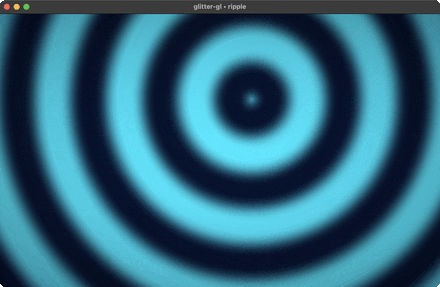
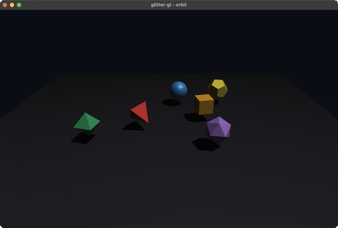
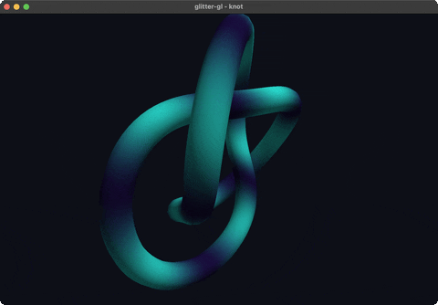
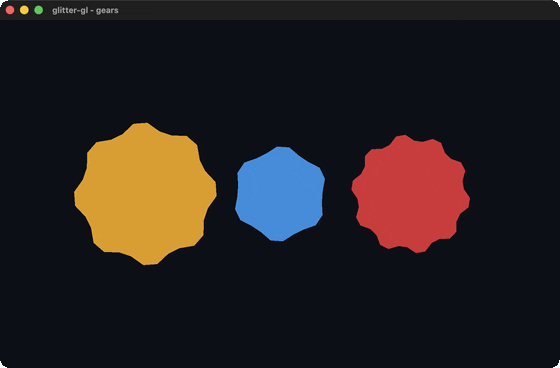
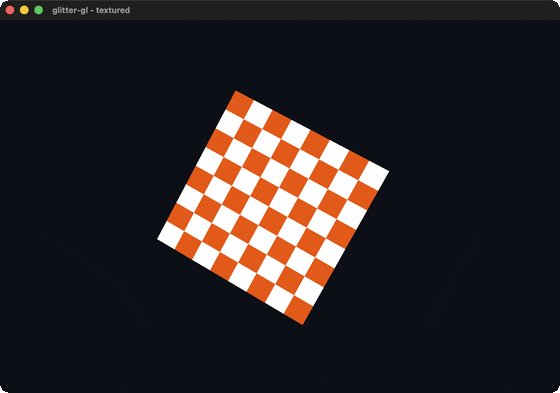
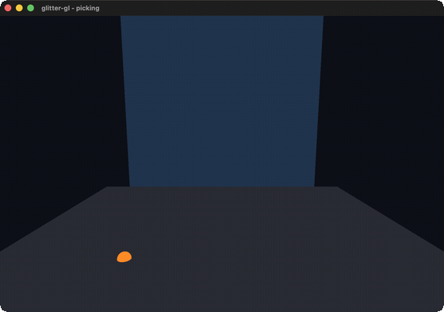

# The examples

Everything runnable lives under `examples/glitter_gl/`: ten namespaces,
nine of them with their own `jolt -M:<alias>`/`bb <name>` entry point, one
(`plasma_shader.clj`) that exists only to be required by `plasma.clj`. They
split cleanly along one axis: two exist to **fail when a regression lands**
(`check.clj`, `gl_area_smoke.clj`), one exists to be **composed and read**
(`plasma_shader.clj`), and seven exist to be **watched**
(`plasma.clj`, `ripple.clj`, `orbit.clj`, `knot.clj`, `gears.clj`,
`textured.clj`, `picking.clj`). Only
the first two are part of the project's actual regression coverage; say so
plainly rather than letting a reader assume a demo is tested because it
runs.

## `check.clj`: headless, and the one that pins the widest surface

```sh
jolt -M:check     # or: bb check
```

Needs no GL context and no display, so it's the fastest thing in the
project to run, and the only example safe to call from a machine with no
windowing system at all. It asserts three unrelated things in one process:

1. `plasma-shader/shader-spec` compiles to GLSL with the declarations the
   composition promised: `a_pos` attribute, `u_time` uniform, the `palette`
   and `plasma` prelude functions. If a future shader-module edit drops a
   uniform or forgets to thread a prelude function through
   `merge-specs`, this is what catches it, headlessly, before anyone opens
   the demo and notices the picture looks wrong.
2. `mesh/->floats` produces a well-formed vertex buffer (positive vertex
   count, buffer length exactly `count * stride`) for each of the three
   primitive shapes the demo can switch between (cube, sphere, tetra).
3. `:gl-area` and `:scale` are both present in `glitter.widget/specs` after
   requiring `glitter-gl.gtk`.

That third assertion is a **load-order check, not an ownership check**,
worth stating precisely because it's easy to misread. `:gl-area` is
registered by this library; `:scale` is not (invariant #6 in
[`CONTRIBUTING.md`](https://github.com/jlt-commons/glitter-gl/blob/main/CONTRIBUTING.md); glitter already ships a
richer, first-party `:scale`, and glitter-gl deliberately doesn't shadow
it). `check.clj`'s own docstring says as much: `:scale` "comes from
glitter's own native widget, not from glitter-gl.gtk." So if `:scale` is
missing when this runs, the bug is that **glitter itself never loaded**,
not that glitter-gl broke something it owns.

Measured, run just now:

```
shader: vs 1327 chars, fs 1403 chars
geometry:
  cube    faces=6 tris=12 verts=36 floats=216 stride=6
  sphere  faces=504 tris=952 verts=2856 floats=17136 stride=6
  tetra   faces=4 tris=4 verts=12 floats=72 stride=6
widgets registered: true
check: ok
```

**What it pins:** the shader-composition contract and the mesh-buffer
contract, both without touching GTK at all. Needing no display makes it
the cheapest thing here to run anywhere, and CI runs it in both jobs (see
[`testing-and-tasks.md`](testing-and-tasks.md)).

## `gl_area_smoke.clj`: live GTK, and the one that pins the correction

```sh
jolt -M:gl-area-smoke     # or: bb gl-area-smoke
```

Needs a real display: it opens an actual `GtkGLArea` under glitter's real
reconciler (not a fake renderer) and drives it through
`:on-realize`/`:on-render`/`:on-resize`, then reads back a `results` atom
the handlers populated and exits non-zero if any of `:realized?`,
`:rendered?`, `:resized?` didn't land, or `:error` is non-nil. Confirmed by
running it here, with a display available:

```
:results {:realized? true, :rendered? true, :resized? [640 480], :error nil}
```

**What it pins:** this is the one example that exercises invariant #2,
`:gl-area`'s handlers wiring through the widget spec's `:apply` closure
rather than `glitter.widget`'s `:connect` hook. That correction was found
*because* the original `:connect`-based design silently never fired under
glitter's real reconciler; a fake in-memory renderer (the kind
`test/glitter_gl/*_test.clj` uses) can't reproduce that failure, because it
never routes props through the real `apply-props!` path at all. This is why
the smoke exists as a separate live-GTK example rather than a unit test;
see the smoke's own docstring, and
[`gl-area-widget-layer.md`](gl-area-widget-layer.md) for the full mechanics.

It's CI-safe in two senses. `bb.edn`'s `smokes` task runs it via
`jolt -M:gl-area-smoke`, the exit-code-propagating alias form rather than
the task form (see [`testing-and-tasks.md`](testing-and-tasks.md)), and
it closes its own window on a timer instead of waiting for a human. CI's
`gl` job runs it, under Xvfb on mesa's llvmpipe, and a failure there
blocks the merge. Running it by hand against a real driver still adds
something CI cannot: llvmpipe is a software rasterizer, not the GL
implementation any user will have.

## `plasma_shader.clj`: composed, not run

This one has no `-main`, no `deps.edn` alias, no `bb.edn` task. It's the
shared shader spec: four data maps (`base`, `plasma-module`,
`stripes-module`, `main-module`) combined with a single call:

```clojure
(def shader-spec
  (sh/merge-specs base plasma-module stripes-module main-module))
```

This demonstrates `glitter-gl.shader`'s composition model rather than
anything glitter-gl-specific. `base` supplies the vertex stage and framing
uniforms; `plasma-module` contributes a domain-warped, 4-octave plasma
field plus an Inigo Quilez cosine palette (both as GLSL text in
`:prelude`, since the shader DSL's data IR only compiles `main()` bodies,
not free functions); `stripes-module` contributes an independent animated
stripe pattern; `main-module` blends the two by `u_mix` and applies
Blinn-Phong-style lighting to the result. Drop a module from the merge, or
add a third, and the visual changes accordingly. That's the point being
demonstrated.

**What it pins:** nothing on its own. It's exercised, not asserted,
by `check.clj`'s shader-compile checks (does the merged spec still emit
`a_pos`, `u_time`, `palette(`, `plasma(`) and rendered, not verified, by
`plasma.clj`. If you're adding a new shader module to this codebase, this
file plus `check.clj`'s three assertions are the pattern to copy: one
adds a data map to the merge, the other adds a `str/includes?` line
asserting the thing that map was supposed to contribute is actually in the
generated source.

## `plasma.clj`: the one to watch, not the one to trust

```sh
jolt -M:plasma     # or: bb plasma
```

A rotating cube/sphere/tetrahedron lit by the composed plasma+stripes
shader, with a glitter-native control panel: shape buttons, five sliders
(speed, zoom, scale, warp, blend), a smooth-shading checkbutton, a
pause/resume button.

| preview | what it shows |
|---|---|
| [](../demos/plasma-cube.gif) | **`plasma-cube`**: the default cube, rotating under the plasma/stripes shader with flat shading, so each face reads as its own solid-color panel, bounded by a sharp edge. |
| [](../demos/plasma-sphere.gif) | **`plasma-sphere`**: the same shader on a sphere. Same flat-shading toggle (off), but the sphere's much higher facet count makes the color read as a continuous gradient instead of blocks. |
| [](../demos/plasma-tetra.gif) | **`plasma-tetra`**: the same shader on a tetrahedron. With only four large triangular faces, this is the clearest case for seeing exactly where flat shading draws the line between one face's color and the next. |
| [](../demos/plasma-smooth.gif) | **`plasma-smooth`**: the cube again, with the smooth-shading checkbutton on: the same plasma pattern now flows continuously across an edge instead of jumping between two flat blocks. The direct visual contrast with the take above. |

Every preview is a real recording of the demo running, not a mockup. They
are committed under `docs/demos/`, and each thumbnail links to the
full-size recording.

**Be honest about what this one is not**: it is not part of `bb.edn`'s
`smokes` task, it makes no assertions, and nothing fails when its picture
regresses except a human noticing it looks wrong. Per the organising
principle for this whole guide (an example that exists only to be pretty
is worth less than one that fails when a regression lands), this is the
"pretty" one. (It does support a `GLITTER_GL_DEMO_QUIT_MS` env var,
mirroring the original's `GLIMMER_GL_DEMO_QUIT_MS`, that auto-closes the
window after N ms, useful for confirming it launches without hanging, but
that's a liveness check, not a correctness one, and it isn't wired into
any automated task today.)

What it *is* worth reading for is invariant #4, in the clearest form
anywhere in this codebase.

### Why it wires `:gl-area` directly instead of going through `reactive-area`

`glitter-gl.app/reactive-area` exists precisely to keep GL plumbing out of
application code: build a scene as data, hand it to `reactive-area`, get
back a ready-made `:gl-area` prop map. `plasma.clj` doesn't use it. It
wires `on-realize`/`on-render`/`on-resize`/`on-tick` by hand, the same way
`gl_area_smoke.clj` does.

The reason is provenance, not oversight: `plasma.clj`'s own docstring says
it's "ported from `gl-demo.core`... converting its reactive-cell control
panel... into glitter's single state atom + data-driven action dispatch,"
while "the GL render-loop plumbing (on-realize/on-render/on-resize/on-tick)
is otherwise unchanged". Direct wiring is how the upstream glimmer-gl demo
already worked, and the port kept that shape rather than routing it through
the newer `reactive-area` layer built later in this project's history.

The honest cost of that choice: until this arc, `reactive-area` had direct
unit coverage (`app_test.clj` checks its returned prop map's shape and
defaults) but no example that mounted it end to end against a real
`:gl-area` and actually rendered through it. See
[`orbit.clj`](#orbitclj-the-first-live-reactive-area-demo) below for the
example that closes that gap, [`scene-and-app.md`](scene-and-app.md#ticking-glitters-state-atom-costs-a-full-view-recompute-not-just-a-frame)'s
"What `reactive-area` actually is" section for the full "honest status"
note, and [`limitations.md`](limitations.md) for this and the project's
other known gaps.

### The two things it demonstrates about the state split

`plasma.clj` is the clearest illustration of invariant #4 (`reactive-area`'s
own handlers read/write state directly rather than dispatching, the same
principle plasma.clj follows even though it bypasses `reactive-area`
itself), because both halves of the split sit right next to each other in
one file:

1. **The GL handlers read and write plain atoms directly.** `on-tick`
   doesn't dispatch anything; it just mutates:

   ```clojure
   (defn on-tick [_area]
     (when-not (:paused @state)
       (swap! clock + (* (double (:speed @state)) frame-dt))))
   ```

   `clock`, `viewport`, and `gl-state` are all `defonce` atoms outside the
   reconciled view entirely, updated 60 times a second by GTK's frame
   clock, exactly the kind of state invariant #4 says has no business
   round-tripping through `swap!`-then-re-render.

2. **The control panel dispatches actions like any other glitter UI.**
   Every slider and button emits a data tuple instead of calling a
   function:

   ```clojure
   [:scale {:min lo :max hi :step step :value value :digits 2 :hexpand true
            :on {:value-changed [[:effect/assoc-in [key] [:glitter/value]]]}}]
   ```

   and the checkbutton/pause controls go through registered actions
   (`:action/toggle-smooth`, `:action/toggle-paused`) that expand to the
   same `:effect/assoc-in` primitive, dispatched through `glitter.nexus`
   exactly the way `todo.clj`/`crud.clj` do in glitter's own demo set.

Put side by side, the contrast answers a question a new contributor will
otherwise have to reconstruct from first principles: *which category does
my new piece of state belong to?* If it changes on every frame and nothing
in the UI needs to react to a click causing it, it's a plain atom. If a
person clicks or drags something, it's an action.

## `ripple.clj`: the shader DSL with no geometry to speak of

```sh
jolt -M:ripple     # or: bb ripple
```

A single `primitives/quad` scaled to fill clip space directly, no MVP, no
camera, no lighting, no material system, textured by a fragment shader
composed through `glitter-gl.shader/merge-specs` from two small modules:
a drifting concentric-ripple field, and a wave-to-color mapping with a
soft corner vignette. `on-tick` advances a time uniform; `on-render`
draws.

The claim this one makes is about the library's two independent halves.
`plasma.clj` already shows a lit solid whose surface comes from a
composable shader, so a second lit-solid-plus-shader demo would say
nothing new. `ripple.clj` has no geometry to speak of, and demonstrates
that the shader-spec DSL is useful entirely on its own, with no mesh
half of the library involved at all.

| preview | what it shows |
|---|---|
| [](../demos/ripple.gif) | **`ripple`**: concentric rings drifting across a full-window quad, generated entirely by the fragment shader; there is no mesh visible because there is nothing to the geometry but the quad. |

Like `plasma.clj`, this is watched, not trusted: it makes no assertions
and is not part of `bb smokes`. `bb.edn`'s own comment on the `smokes`
task explains why: what makes an example usable as a smoke is that it
raises or exits non-zero when something is wrong, not that it calls
`System/exit`. `ripple.clj` wraps program construction in `(try ...
(catch Throwable _ nil))`, so a broken shader just prints and the
process still exits 0; folding it into `smokes` would look like a gate
that cannot fail.

## `orbit.clj`: the first live `reactive-area` demo

```sh
jolt -M:orbit     # or: bb orbit
```

Six distinct solids drawn from the library's own shapes
(`primitives/cuboid`, `primitives/sphere`, `primitives/tetrahedron`, and
`polyhedra`'s octahedron/icosahedron/dodecahedron) orbit above a lit,
shadowed ground plane, each at its own radius, phase, and speed. Unlike
every other example, it's mounted through `glitter-gl.app/reactive-area`
rather than direct `:gl-area` wiring, and its orbit phase lives in
glitter's own shared `state` atom rather than a private clock atom, so
that `scene-fn` is a genuine function of state.

That choice is the whole point of the example, not incidental:
`reactive-area` had direct unit coverage but had never before been
mounted against a real `:gl-area`. `orbit.clj` closes that gap; see
[`limitations.md`](limitations.md#reactive-area-now-has-a-live-demo) for
the before-and-after, and
[`scene-and-app.md`](scene-and-app.md#ticking-glitters-state-atom-costs-a-full-view-recompute-not-just-a-frame)
for the real cost this example pays, by design, for driving glitter's
watched state atom on every tick, which `plasma.clj` and `ripple.clj`
avoid.

| preview | what it shows |
|---|---|
| [](../demos/orbit.gif) | **`orbit`**: six differently-shaped, differently-colored solids circling a shadowed ground plane at independent speeds, most also spinning on their own axis. |

Like `plasma.clj` and `ripple.clj`, watched not trusted: no assertions,
not part of `bb smokes`, for the same reason.

## `knot.clj`: geometry the library does not ship

```sh
jolt -M:knot     # or: bb knot
```

A (2,3) trefoil torus knot, swept as a tube and rendered as a single
rotating lit solid: 2400 quads generated from scratch by a pure function
(`torus-knot-faces`) from three radii (major `R`, winding amplitude `r`,
tube radius `tube-r`) and two counts (`samples`, `sides`), handed
straight to `mesh/mesh`. Everything downstream of the generator, upload,
shader, draw, is the exact single-mesh plumbing `plasma.clj` already
established, wired directly to `:gl-area` rather than through
`reactive-area` (one mesh, no scene composition, nothing for
`reactive-area` to coordinate).

The point is what `primitives.clj` and `polyhedra.clj` are not: a
starting set, not the boundary of what `mesh/mesh` can build. No other
example generates its own geometry; every other one draws a shape the
library already ships as a constructor.

| preview | what it shows |
|---|---|
| [](../demos/knot.gif) | **`knot`**: a rotating, smooth-shaded trefoil torus knot, its tube visibly self-crossing the way a genuine (2,3) knot does rather than closing into a plain ring. |

Like the other two, watched not trusted: no assertions, not part of
`bb smokes`.

## `gears.clj`: `polygon/tessellate`'s first consumer outside its own test suite

```sh
jolt -M:gears     # or: bb gears
```

Three cog outlines, flat-shaded, spinning in a camera-less 2D scene.
`polygon/cog` (added to `glitter-gl.polygon` in this arc, ported from
thi.ng/geom's `thi.ng.geom.polygon/cog`; see `NOTICE.md`) builds a toothed
outline per cog, and `polygon/tessellate` ear-clips that outline directly
into a triangle list. Every other example draws geometry
`glitter-gl.mesh` already tessellates for it (`primitives.clj`/
`polyhedra.clj` shapes go through `mesh/->floats`); `mesh.clj` never
requires `glitter-gl.polygon` at all, and has its own unrelated
`tessellate-face` over Vec3 meshes. Before this file, `polygon/tessellate`'s
only caller anywhere was its own test suite; this is the first thing in
the project to hand it a shape for real.

Each cog's triangle buffer is built once, at namespace load; `on-render`
never rebuilds geometry, it only rotates the three buffers, at different
signed speeds so adjacent cogs counter-rotate, via a per-cog model matrix,
the same way `knot.clj` spins its tube by matrix alone. `m/ortho` stands in
for `m/perspective`: there's no camera, just a flat orthographic frame wide
enough to hold all three cogs side by side.

| preview | what it shows |
|---|---|
| [](../demos/gears.gif) | **`gears`**: three cog outlines of different radii and tooth counts, spinning at different signed rates so the two outer cogs turn one way and the middle one turns the other. |

Like the others above, watched not trusted: no assertions, not part of
`bb smokes`.

## `textured.clj`: the first shader spec to sample a texture

```sh
jolt -M:textured     # or: bb textured
```

A rotating cube wearing a procedurally generated checkerboard: no image
file, no binary asset in the repo. `checkerboard-ptr` writes an RGBA byte
buffer straight into foreign memory at realize time. `p/cuboid` supplies
the mesh; since `mesh/->floats` only ever emits position and normal, this
file builds its own interleaved position+UV buffer by hand
(`cube-uv-floats`), matching UV corners to `p/cuboid`'s own per-face
winding so every face shows the full checkerboard once.

This is the first consumer of `glitter-gl.gl`'s texture FFI
(`gl-gen-textures`/`gl-bind-texture`/`gl-tex-image-2d`/
`gl-tex-parameter-i`/`gl-active-texture`) outside `renderer.clj`'s internal
shadow-map path and the test suite (`offscreen_test.clj` exercises the
same fns headlessly), and the first shader spec in the project to declare a
`:sampler2D` uniform. Worth stating plainly, since "first user of X"
invites the assumption that X was broken: no library gap was found here.
`shader.clj`'s `set-uniform!` already had a working `:sampler2D` branch,
uploading the texture unit index via `glUniform1i`; it had simply never
had a caller before this file.

The one uniform that's easy to get wrong, `:u_texture`, must be set to the
texture *unit* index (`0`), never the GL texture id `gl-gen-textures`
returned; `on-render` sets it correctly on every frame, the same
"set every declared uniform explicitly" discipline `ripple.clj`'s ns
docstring describes.

| preview | what it shows |
|---|---|
| [](../demos/textured.gif) | **`textured`**: a cube rotating on two axes, its faces showing a crisp white-and-orange checkerboard baked at runtime rather than loaded from a file. |

Like the others above, watched not trusted: no assertions, not part of
`bb smokes`.

## `picking.clj`: the first example to react to the pointer

```sh
jolt -M:picking     # or: bb picking
```

A ground plane and a back wall, with a small sphere marker drawn at
wherever the pointer's world-space ray hits one of them: amber for the
ground, magenta for the wall, so the switch is visible without reading
coordinates. Every other example draws geometry that never reacts to
input; this is the first to use pointer events at all, and the first
consumer of `glitter-gl.intersect` (specifically its `ray-plane`
function) outside its own namespace and test suite.

`on-motion` only stores the latest pointer position; the actual raycast
happens in `on-render`, every frame, re-reading whatever `pointer-pos`
currently holds, so a fast pointer doesn't queue extra work per event.
Unprojecting a screen pixel into a world-space ray needs the real
perspective divide: `glitter-gl.matrix/transform-point` is documented as
an affine-only transform (it assumes a constant w row, true for
model/view matrices but not for a projection matrix), so this file
supplies its own `unproject`, doing the full four-component transform
including the divide by w. It re-derives the divide-by-w half of
thi.ng/geom's `unproject-point` (`src/thi/ng/geom/matrix.cljc`): the port
that produced `matrix.clj` never carried that function over, so there was
nothing to call. See `NOTICE.md` for the full attribution.

**A real widget-layer trap, found live during this arc**: `GtkGLArea`'s
resize signal reports the framebuffer size in *device* pixels (2x on a
Retina display), while `:on-motion` reports *logical* points. Unprojecting
a pointer position using the viewport dimensions captured from resize is
silently wrong by the display's scale factor on a Retina display, and
invisible on a non-Retina one, where the two units happen to coincide.
`picking.clj` avoids it by sourcing width and height from
`glx/widget-width`/`glx/widget-height` (both logical) rather than from its
own `@viewport` atom (kept for `gl/gl-viewport`, which does want device
pixels). See
[`gl-area-widget-layer.md`](gl-area-widget-layer.md#device-pixels-vs-logical-points-a-retina-only-trap)
for the full mechanics.

| preview | what it shows |
|---|---|
| [](../demos/picking.gif) | **`picking`**: a marker tracking the pointer across a ground plane and a back wall, switching color at the boundary where the ray leaves one plane and hits the other. |

Like the others above, watched not trusted: no assertions, not part of
`bb smokes`.

**A forced or content-triggered `bb record` would destroy this GIF, not
reproduce it.** `picking` is pointer-driven, and
`scripts/demo_manifest.edn`'s steering is keyboard-only, so an actual
re-capture of this take would show the scene at rest, with no marker at
all, silently overwriting the committed GIF with an empty one. That risk
is not standing today: `docs/demos/ledger.edn`'s `picking` entry already
matches this file's current content hash, so an ordinary
`bb record --only picking` (or `--dry-run`) reports it up to date and
skips it (`1 items, 0 to capture, 1 up to date`, verified). The hazard
becomes real only if `picking.clj` changes, invalidating that hash, or if
`--force` is passed. Under either condition: the committed GIF was
captured outside the normal recording pipeline, by synthesizing pointer
motion with Quartz `CGEventPost` while taking a screenshot per frame;
reach for that approach instead of `bb record`.

## Adding an example

Six touchpoints; skip one and the example is invisible to something:

1. **The namespace**, under `examples/glitter_gl/`.
2. **A `deps.edn` alias**, so `jolt -M:<name>` works without babashka:

   ```clojure
   :gl-area-smoke {:extra-paths ["examples"] :main-opts ["-m" "glitter-gl.gl-area-smoke"]}
   ```
3. **A `bb.edn` task**, so `bb <name>` works and it shows up in `bb info`:

   ```clojure
   gl-area-smoke {:doc "Live-GTK smoke: :gl-area construct/realize/render/resize"
                  :task (shell "jolt" "-M:gl-area-smoke")}
   ```
4. **A `bb.edn` `demos:examples` row**, so `bb record`'s gallery pipeline
   knows the example exists:

   ```clojure
   {:id "orbit"
    :group "orbit"
    :desc "six distinct solids orbiting above a ground plane, lit and shadowed, mounted via reactive-area"
    :src "examples/glitter_gl/orbit.clj"
    :run "jolt -M:orbit"}
   ```
5. **A `scripts/demo_manifest.edn` group entry**, matching the row's
   `:group` key, so the recorded GIF gets its own gallery heading:

   ```clojure
   {:key "orbit" :title "the orbit demo"}
   ```
6. **If it's a live-GTK example that asserts and exits non-zero on
   failure**, add it to `bb.edn`'s `smokes` task so `bb smokes` actually
   runs it:

   ```clojure
   smokes {:doc "Run every live-GTK smoke and headless check in sequence; stops at the first failure"
           :task (do (shell "jolt" "-M:gl-area-smoke")
                     (shell "jolt" "-M:check"))}
   ```

   Skipping this step doesn't break the new example; it just means
   nobody running `bb smokes` (or a future CI job built on it) ever
   exercises it, the same silent gap `plasma.clj` has today by design.

A smoke's own `-main` must exit non-zero on failure and be invoked via
`jolt -M:<alias>`, never the bare `jolt <task>` shorthand; see
[`testing-and-tasks.md`](testing-and-tasks.md) for why the task form can't
be trusted to fail a build at all.
